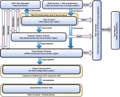

# UITAF Architecture

## Overview

**UITAF (UI Test Automation Framework)** is a sophisticated, minimalistic framework designed for automated UI testing using Selenium. It incorporates a page-component architecture and integrates with Allure for comprehensive reporting.

UITAF streamlines the creation of automated UI tests by providing:
    - **Automatic Test Data Generation**: Facilitates efficient test creation by automatically generating data sets from page objects.
    - **Detailed Reporting**: Generates comprehensive reports at the end of test executions.

The framework introduces the **"domain-objects"** design pattern, enhancing business-oriented testing by efficiently managing complex scenarios that span multiple web pages.

**UITAF** supports concurrent testing, allowing for:
    - **Simultaneous Execution**: Run multiple test cases concurrently across various browsers, Selenium grids, or cloud-based virtual machines.
    - **Efficient Resource Utilization**: Optimizes testing efficiency and resource management.

The framework integrates seamlessly with continuous integration systems, providing:
    - **Easy Configuration**: Configures tests for execution across different environments.
    - **Embedded Reporting**: Embeds test reports within CI server jobs.

## Architecture

The architecture of UITAF is illustrated below:

Key components include:

- **Selenium WebDriver**: Controls the web browser to simulate user interactions with the web application under test.
- **Web Page Components**: Reusable libraries encapsulating the operation and testing of HTML elements, developed using the Selenium WebDriver API.
- **Page Object Models**: Represent specific web page components and services, providing methods for interacting with HTML elements without directly using the Selenium WebDriver API.
- **Domain Object Models**: Encapsulate business logic that spans multiple web pages, aggregating Page Objects to offer business-oriented methods.
- **Test Orchestration and Concurrency**: Manages multiple test scenarios and data provisioning, allocating execution threads from a configurable pool.
- **XML Test Data Sets**: Structured files defining test parameters and expected results, used for input data and validation during tests.
- **Test Scripts**: Java code implementing test scenarios using Domain Objects and Page Objects.
- **Test Context and Parameters**: Configure global environments, including WebDriver instances and test timeouts.
- **Test Lifecycle**: Records and aggregates test execution events, generating reports based on these events.
- **Test Report**: A web application generated from Test Lifecycle artifacts, providing detailed views of test execution data.

## Test Automation Components

UITAF is built around **Test Automation Components**, which simplify the automation of complex UI elements in modern web applications. These applications often use JavaScript UI component libraries (e.g., Angular, React, Lightning Web Components (LWC)) that combine primitive HTML elements with JavaScript logic.

**Page Components** in UITAF are Java classes that encapsulate automation behavior for reusable UI elements. These components abstract the complexity of underlying HTML elements and JavaScript code, making them reusable across multiple pages. If the UI framework changes, only the Component Library needs to be updated, preserving existing test artifacts.

**Key Benefits**:
    - **Component Libraries**: Abstract complexity and ensure reusability across different pages.
    - **Page Component Integration**: Extends the Page Object model by incorporating Page Components as fields, thus simplifying Page Object code and abstracting Selenium WebDriver API interactions.
    - **Data Framework Facilities**: Handle test data using serialization/deserialization of Page Objects to XML templates, supporting dynamic data generation and expression language mechanisms.

The **Domain Object** design pattern is an extension of the Page Object model that focuses on business logic across multiple pages. Domain Objects aggregate Page Objects to provide methods that manage business processes, making tests more maintainable and understandable.
