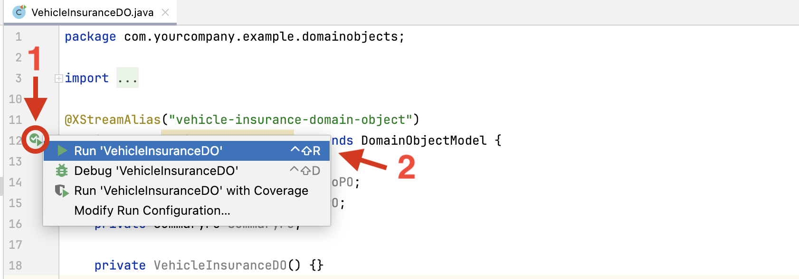
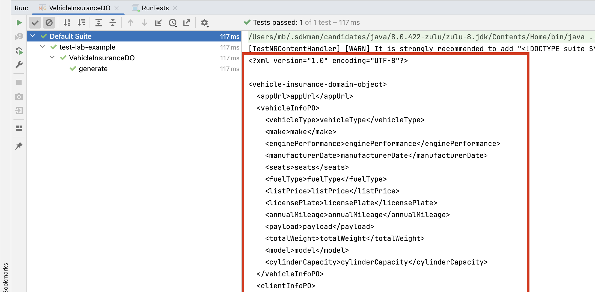

# Page Object (UITAF Way)

The UITAF Page Object Model is conceptually similar to the traditional Selenium Page Object Model but has a distinct difference in its approach to defining elements.

## Selenium Page Object Model

- **Abstract WebElements:** In Selenium, Page Objects use abstract WebElement fields to represent elements on the page. These fields are typically defined as private or protected and are accessed through methods or direct field access.
- **Example:**

    ```java
    public class LoginPage {
        @FindBy(id = "username")
        private WebElement usernameField;

        @FindBy(id = "password")
        private WebElement passwordField;

        @FindBy(id = "loginButton")
        private WebElement loginButton;

        public void login(String username, String password) {
            usernameField.sendKeys(username);
            passwordField.sendKeys(password);
            loginButton.click();
        }
    }
    ```

## UITAF Page Object Model

- **Concrete Page Components:** Unlike Selenium, UITAF’s Page Object Model requires the use of concrete WebComponent instances rather than abstract WebElement fields. These Page Components are fully implemented, encapsulating the interactions with specific elements on the page.
- **Automatic Data Initialization:** A key advantage of the UITAF Page Object Model is its ability to automatically initialize Page Component fields with data. This is achieved through deserialization from an XML dataset, eliminating the need for methods with arguments to populate components. As a result, all Page Object fields are pre-configured with their specific data, simplifies the test data provisioning.
- **Advanced Data Population with setElementValue(PageComponent):** The provided setElementValue(PageComponent) method is highly sophisticated. This method not only populates a specific Page Component with the required data but also simulates realistic user behavior. Upon populating the field, the method verifies that the data has been entered correctly. If the initial attempt is unsuccessful, the method retries up to three times. Should the data entry still fail after these attempts, the test is marked as failed, and an exception is thrown. This approach reflects real-world scenarios where user input may not always be successful on the first try, thereby enhancing the reliability and robustness of UITAF-based tests. In cases where the entered data is mutated, and there is a need to validate which value should be present during component population, the setElementValue method will prioritize the Expected data type over the provided Data type. [(See Data Provisioning and Data Types)](pagecomponent.md#data-provisioning-and-data-types)
- **Example:**

```java
public class LoginPage extends PageObjectModel {
    @FindBy(id = "username")
    private WebComponent usernameField;

    @FindBy(id = "password")
    private WebComponent passwordField;

    @FindBy(id = "loginButton")
    private WebComponent loginButton;

    public void login() {
        setElementValue(usernameField);
        setElementValue(passwordField);
        loginButton.click();
    }
}
```

In summary, the UITAF Page Object Model not only simplifies the test setup process through automatic data initialization but also introduces a sophisticated mechanism for ensuring accurate data entry through the setElementValue(PageComponent) method. This capability, which mimics user behavior and ensures data integrity, significantly enhances the reliability and effectiveness of UITAF in test automation.

## Automating Boilerplate Code in Page Objects

The UITAF Page Object Model offers a powerful time-saving feature for handling repetitive tasks: the Automatic Population of all declared Page Components through a single method called autoFillPage(). This method significantly simplifies the process of populating Page Objects, especially in cases where a form contains numerous fields of various types.

For instance, if you have a form with 20 or more fields, instead of manually populating each field individually, the autoFillPage() method will automatically iterate over all the fields with initialized data, invoking the setElementValue command for each one. This automation reduces the need for boilerplate code and enhances efficiency.

In addition to **autoFillPage()**, UITAF provides the **autoValidatePage()** method, which automatically validates all declared Page Components within the Page Object against their expected data types. This ensures that the data entered into each component is accurate and meets the specified requirements.

:::info[**Skip Fields Automatic population and validation**]

In cases where certain Page Object fields should not be automatically populated, such as buttons that do not require data values, or if you wish to handle certain fields differently, you can annotate those fields with **@SkipAutoFill** or **@Data(skip = true)** annotations. Similarly, to skip the automatic validation of a specific field, you can use the **@SkipAutoValidate** or **@Data(skip = true)** annotations. The **@Data(skip = true)** annotation will bypass both automatic population and validation.

:::

For scenarios where custom handling of Page Components is required, UITAF includes the enumerateFields() method. This method allows you to iterate over all Page Components in the Page Object, providing the flexibility to implement your own mechanisms for dealing with these components.
[**See Vehicle Information POM example**](test_lab/test_logic.md#vehicle-information-pom) and [**Summary POM example**](test_lab/test_logic.md#summary-pom)

## Dataset Generation and Deserialization

Dataset generation and deserialization are key features of the UITAF framework, making test data management more efficient.

### Data Generation

This process involves creating XML datasets from Page Objects and Domain Objects. You can initiate the generation process by clicking the run button on the left side of the IntelliJ editor while viewing a specific Page Object or Domain Object. The generated XML serves as a template where field values are initially set to their tag names. This template must be edited to include specific data required for your tests.

To generate data for the Page Object or Domain Object, follow these steps:

1. Open the Page Object Or Domain Object class in IntelliJ.
2. Click the run button on the left side of the editor, next to the class declaration.
3. Select the **Run '\<Class Name\>'** option from the dropdown menu that appears.
Refer to the following picture for visual guidance:

After performing these actions, the test data will be generated and displayed in the IntelliJ Run Tool Window, located at the bottom of the IDE.

Copy the XML content starting from the ```<?xml version="1.0" encoding="UTF-8"?>``` line and extending to the last closing XML tag. Paste this content into a new file in the resources/data directory. You can then modify this file to include data values for the specific scenario. For example, automobile-data.xml is used for testing Automobile Insurance; this file was initially generated and then modified to include valid data.

### Deserialization

Once the XML dataset is edited, it can be deserialized back into Page Objects or Domain Objects. This deserialization process automatically initializes all Page Components with the corresponding data, streamlining test execution and eliminating the need for manual data entry.

In UITAF, the deserialization of a Page Object or Domain Object is often the first step in a TestNG test method. This process involves converting an XML dataset file located in the resources folder (e.g., src/main/resources/data/random-data.xml) into a Domain Object that can be used during the test execution.

To deserialize a dataset file into a Domain Object named VehicleInsuranceDO, the following Java code can be used within the test method:

```java
VehicleInsuranceDO vehicleInsuranceDO = new VehicleInsuranceDO().fromResource("data/random-data.xml");
```

### Aliases

XML datasets support the use of aliases as variables, defined in the **\<aliases\>** section of the XML. These aliases are evaluated only once during the Page Object deserialization process and are global to the test execution thread. They can be used across Page Objects or tests to reduce human errors when duplicating values. Aliases can hold static values or utilize dynamic data generation expressions, including JEXL (Java Expression Language) expressions. JEXL expressions are powerful and versatile, allowing for advanced data manipulation by invoking services to gather values or retrieving data from databases.

:::note

By leveraging dataset generation and deserialization, along with the use of aliases, UITAF helps to keep data-related logic separate from your test code and other test artifacts, preventing the creation of unmaintainable, convoluted code.

:::

### Data Generators

UITAF provides a variety of data generators that can be utilized within data generation expressions. These expressions are formatted within square brackets and prefixed with a dollar sign, following this structure: $[GENERATOR_NAME('PATTERN', 'VALUES')].

- GENERATOR_NAME: Indicates the specific data generator being used.
- PATTERN: Defines the template for the generated data.
- VALUES: Provides the comma-separated parameters necessary for data generation.

```xml title="Here is an example of some available data generators:"
<aliases>
    <address>$[ADDRESS('{#} {S}, {T}, {P}, {K} {O}, {C}', '')]</address>
    <alphanumeric>$[ALPHANUMERIC('(A)(B)(C)(D)-[a][b][c]', '')]</alphanumeric>
    <custom_list>$[CUSTOM_LIST('', 'Automobile,Truck,Motorcycle')]</custom_list>
    <date>$[DATE('yyyy-MM-dd', '2000/01/01|2024/12/31|yyyy/MM/dd')]</date>
    <number>$[NUMBER('', '1000,100000')]</number>
    <human_names>$[HUMAN_NAMES('{M} {S}', '')]</human_names>
    <word>$[WORD('{a} {b} {c}', '')]</word>
</aliases>
```

#### Address Generator

Generates addresses, currently supporting only Canadian addresses. The VALUES argument is not utilized. The PATTERN argument accepts the following placeholders:

- \{#\}: Street number
- \{S\}: Street name
- \{T\}: City
- \{P\}: Province name
- \{K\}: Province code
- \{O\}: Postal code

#### Alphanumeric Generator

Generates alphanumeric strings based on a specified pattern. The VALUES argument is not used. The PATTERN argument accepts characters and patterns where:

- (a)–(z): Lower-case letter
- (A)–(Z): Upper-case letter
- \[0\]–\[9\]: Digit between 0 and 9
- |a|–|z|: Lower-case letter or number
- |A|–|Z|: Upper-case letter or number
- \{a\}–\{Z\}: Any-case letter or number

:::note

Identical symbols represent the same letter. For example, the pattern (a)(b)(a)\[z\]\[Z\]\[z\] could generate strings like drd101 or ifi5Y5.
  
:::

#### Custom List Generator

Selects a random value from a provided list. The VALUES argument accepts a comma-separated list of values. The PATTERN argument is not used.

- For example, the expression $\[CUSTOM_LIST('', 'Automobile,Truck,Motorcycle')\] may randomly choose one of the three provided options.

#### Date Generator

Generates dates. The PATTERN argument specifies the Java SimpleDateFormat pattern for formatting the resulting date. The VALUES argument represents a range of dates to select from, provided as a pipe-separated (|) list that includes the start date, end date, and a range date pattern.

- For example, the expression $\[DATE('yyyy-MM-dd', '2000/01/01|2024/12/31|yyyy/MM/dd')\] generates a date within the specified range, formatted according to the provided pattern.

#### Number Generator

Generates a number from a given range of integer values. The PATTERN argument is not used. The VALUES argument includes a comma-separated list representing the start number and end number of the range.

- For example, the expression $\[NUMBER('', '1000,100000')\] generates a random number between 1,000 and 100,000.

#### Human Names Generator

Generates human first and last names. The VALUES argument is not used. The PATTERN argument accepts the following placeholders:

- \{F\}: Female first name
- \{M\}: Male first name
- \{A\}: Any gender first name
- \{S\}: Last name
- For example, the expression $\[HUMAN_NAMES('\{M\} \{S\}', '')\] might generate names like "John Smith" or "Michael Johnson."

#### Word Generator

The Word Generator produces a combination of English words based on a specified pattern. The PATTERN argument follows these rules:

- \{A\}–\{Z\} or \{a\}–\{z\}: Replaces the placeholder with a random English word. Upper-case letters in the tag generate upper-case words, while lower-case letters generate lower-case words.
- \[A\]–\[z\]: Replaces the placeholder with a random English word, with each letter randomly cased.
- |A|–|z|: Replaces the placeholder with a capitalized random English word.
- \{A:0-9\}–\{Z:0-9\} or \{a:0-9\}–\{z:0-9\}: Replaces the placeholder with a specified number of upper-case or lower-case characters (1-9) from the start of a random English word. If the number is 0, a random number of characters (1-9) is selected.
- \[A:0-9\]–\[Z:0-9\]: Replaces the placeholder with a specified number of randomly cased characters (1-9) from the end of a random English word. If the number is 0, a random number of characters (1-9) is selected.

Additional Guidelines:

Identical tags in the pattern will be replaced by the same word. For example:

- \{A\},\{A\} results in "SLEEP,SLEEP".
- \{c:3\}\{c:3\} results in "tortor".
- \[B:2\]\[B:2\] results in "POPO".
- \[A\] and \{A\} are treated independently and will not produce the same word.

### JEXL Expressions

UITAF XML dataset can include JEXL (Java EXpression Language) expressions. These JEXL expressions are formatted within curly braces and prefixed with a dollar sign, following this structure: ```${'hello world'.toUpperCase()}```. For more details about JEXL expressions, visit the [JEXL Online Documentation](https://commons.apache.org/proper/commons-jexl/reference/syntax.html).

JEXL can recognize and evaluate UITAF-provided variables such as:

- **env:** Exposes the currently selected environment. For example, ```${env.getUrl()}``` returns the URL of the current environment.
- **now:** Exposes the current date and time.
- All data generators are also exposed as **AddressGen, AlphaNumericGen, ListGen, DateGen, HumanNameGen, NumberGen, and WordGen**. Each of these generators has its own unique methods for generating data. Here is an example of how to generate address fields:

```xml
<aliases>
    <address>${AddressGen.generateAddress()}</address>
    <streetNumber>${address.streetNumber}</streetNumber>
    <streetName>${address.streetName}</streetName>
    <city>${address.city}</city>
    <postalCode>${address.postalCode}</postalCode>
    <province>${address.provinceName}</province>
    <country>${address.country}</country>
</aliases>
```

## Exposing Custom Functionality for JEXL Expressions

If you have a REST service or database from which you need to retrieve data for validation purposes, and you have created a helper class (e.g., DataService) with a method like getData(), you can expose this service to JEXL expressions by overriding the initJexlContext(JexlContext) method in your Page Object.

Here's how you can provide an alias for your service:

```java
@Override
protected void initJexlContext(JexlContext jexlContext) {
    super.initJexlContext(jexlContext);
    jexlContext.set("serv", new DataService());
}
```

In this example, a JEXL alias named serv is created and initialized with a new instance of DataService. You can then utilize this alias in your JEXL expressions within your dataset, enabling you to incorporate and leverage custom functionality as needed:

```xml
<aliases>
    ...
    <data>${serv.getData()}</data>
    ...
</aliases>
```

:::note
If you need all Page Objects in your test to access the same service, you can achieve this by creating a superclass for your Page Objects. In this superclass, override the **initJexlContext(JexlContext)** method to include your custom services. Each Page Object in your test suite can then inherit from this superclass, ensuring consistent access to your services across all Page Objects. Another option is to use Domain Object with the same owerwritten **initJexlContext(JexlContext)** method
:::
