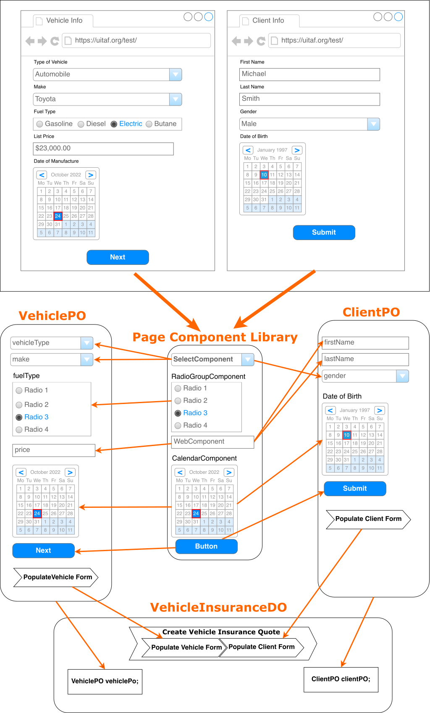

# Thinking UITAF Way



## **Introduction**

Before creating any test, we need to examine the business scenario that requires testing within UITAF. Understanding the scenario allows us to identify the relevant pages and components. In this example, we will create and test a **Vehicle Insurance Quote** application. This process spans two pages: the **Vehicle Information Page** and the **Client Information Page**.

The steps below outline the process of creating Page Components, Page Objects, Domain Objects, generating datasets, and executing the test in UITAF.

---

## **Identifying Page Components**

The first step is identifying the UI components on the pages that require special handling. UITAF's **generic WebComponent** might not be sufficient for certain composite components, which necessitates creating custom Page Components. In our case, we identified five distinct components:

1. **SelectComponent** – for dropdown option selection.
2. **WebComponent** – for entering text (used generically for input fields).
3. **RadioGroupComponent** – for managing radio button groups.
4. **CalendarComponent** – for date selection.
5. **Button** – which can also be handled using the generic `WebComponent`.

Each identified component will be part of the **Page Component Library**, which contains pre-built components designed to automate specific UI libraries used in the web application under test.

:::info

- In case the application switches to another JavaScript UI framework (e.g., from React to Angular), we only need to develop a new Component Library for the new framework. The rest of the automation artifacts remain intact.
- The clutter of Selenium WebElement code is completely removed from Page Objects, and moved instead in to components leaving only page-specific business methods. There are no other artifacts in UITAF which are using Selenium API but only Page Components. 

:::

---

## **Creating Page Components**

For each of the identified components, we create a corresponding Java class that inherits from the **PageComponent** superclass. These custom classes encapsulate logic for:

- **Populating data** (filling element with provided data, selecting options, etc.).
- **Reading data** (extracting values for validation).

This modular approach simplifies the automation and ensures reusability across pages.

---

## **Creating Page Objects**

After defining the Page Components, we create **Page Objects** for each of the pages involved in the business scenario. In this example, the two Page Objects are:

1. **VehiclePO**: Represents the **Vehicle Information Page**.
   - Contains fields for components such as `SelectComponent`, `WebComponent`, `RadioGroupComponent`, and `CalendarComponent`.
   - Implements a method called `populateVehicleForm()`, which populates all the fields on the Vehicle Information page and navigates to the next page.

2. **ClientPO**: Represents the **Client Information Page**.
   - Contains fields for components like `WebComponent`, `RadioGroupComponent` and other.
   - Implements a method called `populateClientForm()`, which populates all the fields related to the client's information and submits the form.

---

## **Creating the Domain Object**

A **Domain Object** in UITAF models the business logic that spans across multiple web pages (Page Objects). In this example, we create a `VehicleInsuranceDO` class to represent the entire business process of creating a vehicle insurance quote.

### **VehicleInsuranceDO Class:**

- Contains two fields representing the Page Objects:
  - `VehiclePO vehiclePage;`
  - `ClientPO clientPage;`
  
- Defines a business method called **createVehicleInsuranceQuote()** that:
  - Instantiates the `VehiclePO` and calls its `populateVehicleForm()` method.
  - Instantiates the `ClientPO` and calls its `populateClientForm()` method.

This method simulates the end-to-end business process of filling out and submitting the insurance quote.

---

## **Generating Dataset Templates**

After creating the Domain Object, we generate a dataset template. This step involves:

1. Running the `VehicleInsuranceDO` class, which automatically generates an XML template that includes all fields from both Page Objects.

2. Modifying the generated XML file with the specific data required for the test scenario. This XML dataset will be used during test execution.

The advantage of generating datasets is that the structure is reusable for future test cases, requiring only data modification without changing the code.

---

## **Creating the Test Case**

The final step is creating the actual test case in the `TestVehicleInsurance` class. This class will inherit from the `TestNGBase` superclass and implement the test logic.

### **Test Case Steps:**

1. **Create the Test Class:**
   - Define a `TestVehicleInsurance` class that extends `TestNGBase`.

2. **Test Method:**
   - Annotate the test method with `@Test` from TestNG.
   - Instantiate the **VehicleInsuranceDO** Domain Object.
   - Deserialize the XML dataset

   The following simple line of code initializes **VehicleInsuranceDO** class and loads the required test data from the dataset file. 

   ```java
   VehicleInsuranceDO vehicleInsuranceDO = new VehicleInsuranceDO(getContext()).fromResource("data/motorcycle-data.xml");
   ```

3. Invoke the Business Method:

   - Invoke the **createVehicleInsuranceQuote()** method on the **VehicleInsuranceDO** Domain Object to execute and test the business scenario.

4. Running, Debugging and Reporting Support

The final step involves running and debugging the solution. Ensure that the test executes correctly and performs as expected. If everything is functioning correctly, annotate the required methods with the @Step annotation and provide a description. This will enable the generation of a detailed report at the end of the test execution, providing valuable insights into the test process and results.

This completes the process of creating a test using UITAF. The approach described can be universally applied to any business application. By implementing these steps, you can be confident that your application will be thoroughly tested and will require less maintenance.
